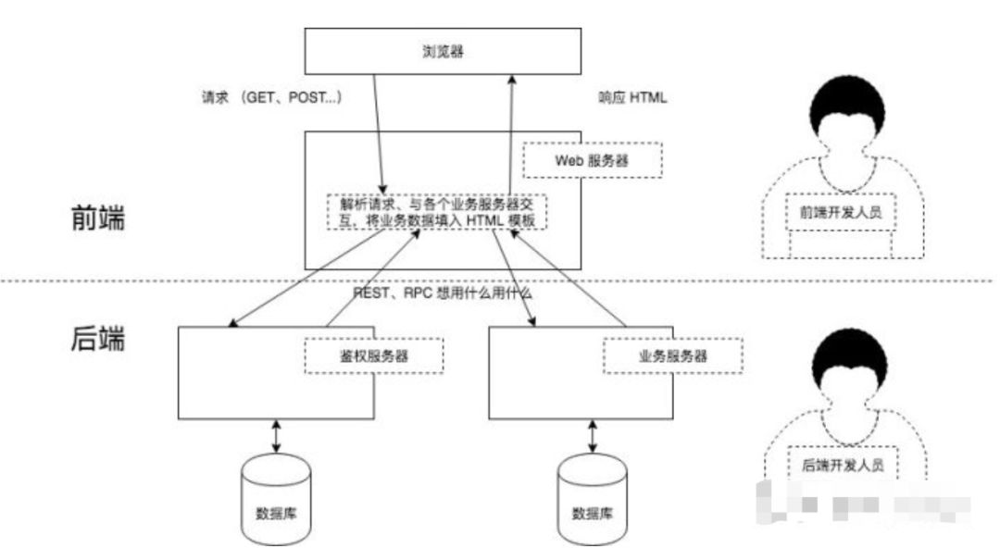

# 技术选型

[TOC]

## 1、SPA和MPA对比

### 1.MPA

传统的项目大多使用多页应用结构（MultiPage Application, MPA），需要切换内容的时候我们往往会进行单个html文件的跳转，这个时候受网络、性能影响，浏览器会出现不定时间的空白界面，用户体验不好。

### 2.SPA

单页面应用SPA应用（single page application）就是用户通过某些操作更改地址栏url之后，动态的进行不同模板内容的无刷新切换，用户体验好。

Vue中会使用官方提供的vue-router插件来使用单页面，原理就是通过检测地址栏变化后将对应的路由组件进行切换（卸载和安装）。

### 3.两者对比

| SPA vs MPA          | 单页面应用（single page application, SPA）                   | 多页面应用（MultiPage Application, MPA） |
| ------------------- | ------------------------------------------------------------ | ---------------------------------------- |
| 组成                | 一个外壳页面和多个页面片段组成                               | 多个完整页面构成                         |
| 资源共享（css、js） | 共用只需要在外壳部分加载                                     | 不共用，每个页面都需要加载               |
| 刷新方式            | 页面局部刷新或更改                                           | 整页刷新                                 |
| url模式             | a.com/#/pagonea.com/#/pagtow                                 | a.com/#/pagone.htmla.com/#/pagtwo.html   |
| 用户体验            | 页面片段切换快，用户体验好                                   | 页面切换加载缓慢，流畅度不够用户体验较差 |
| 转场动画            | 容易实现                                                     | 无法实现                                 |
| 数据传递            | 容易                                                         | 依赖url传参、或者cookie、localStorage等  |
| 搜索引擎优化（SEO） | 需要单独方案、实现较为困难、不利于SEO检索 可以利用服务器端渲染（ssr）优化 | 实现方法简易                             |
| 适用范围            | 高要求的体验度，追求界面流畅的应用                           | 适用于追求高度支持搜索引擎的应用         |
| 开发成本            | 较高，常需借助专业的框架                                     | 较低，但页面重复代码多                   |
| 维护成本            | 相对容易                                                     | 相对复杂                                 |

## 2、前端

### 2.1、vue-resource

- [vue-resource](https://link.jianshu.com?t=https://github.com/pagekit/vue-resource)是Vue.js的一款插件，它可以通过XMLHttpRequest或JSONP发起请求并处理响应。也就是说，$.ajax能做的事情，vue-resource插件一样也能做到，而且vue-resource的API更为简洁。

### 2.2 、axios

- Axios 是一个基于 promise 的 HTTP 库，可以用在浏览器和 node.js 中。
- **特点**
  - 支持浏览器和node.js
  - 支持promise
  - 能拦截请求和响应
  - 能转换请求和响应数据
  - 能取消请求
  - 自动转换JSON数据
  - 浏览器端支持防止CSRF(跨站请求伪造)

### 2.3、vuex

- [Vuex](https://vuex.vuejs.org/zh/) 是一个专为 Vue.js 应用程序开发的**状态管理模式**。它采用集中式存储管理应用的所有组件的状态，并以相应的规则保证状态以一种可预测的方式发生变化。

## 3、后端

4、前后端分离

- 前后端不分离

- 前后端分离

  