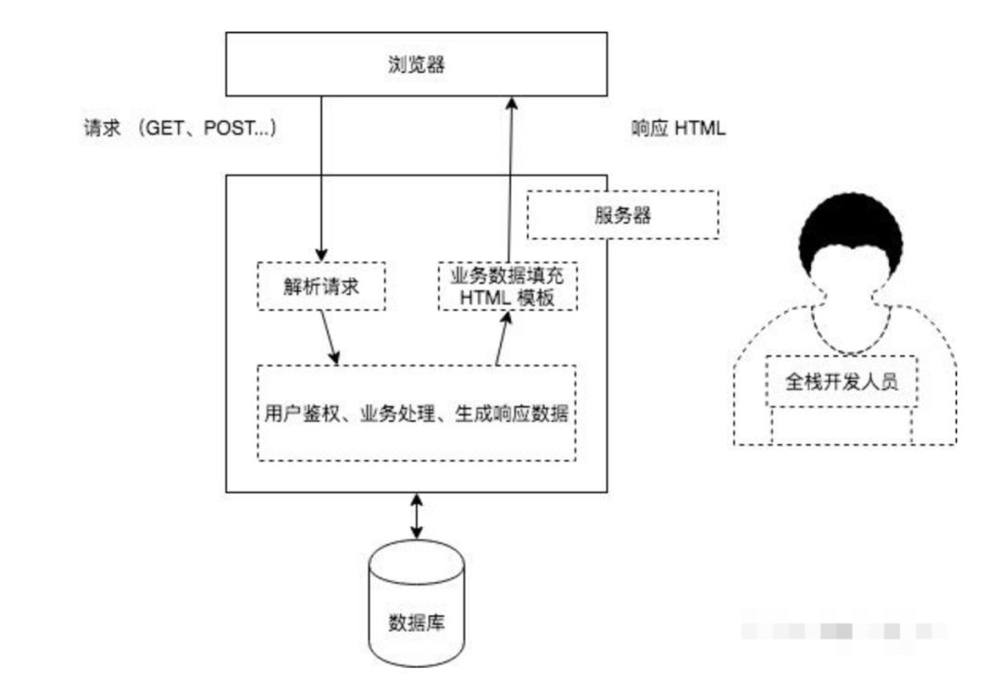

# 技术选型

[TOC]

## 1、SPA和MPA对比

### 1.MPA

传统的项目大多使用多页应用结构（MultiPage Application, MPA），需要切换内容的时候我们往往会进行单个html文件的跳转，这个时候受网络、性能影响，浏览器会出现不定时间的空白界面，用户体验不好。

### 2.SPA

单页面应用SPA应用（single page application）就是用户通过某些操作更改地址栏url之后，动态的进行不同模板内容的无刷新切换，用户体验好。

Vue中会使用官方提供的vue-router插件来使用单页面，原理就是通过检测地址栏变化后将对应的路由组件进行切换（卸载和安装）。

### 3.两者对比

| SPA vs MPA          | 单页面应用（single page application, SPA）                   | 多页面应用（MultiPage Application, MPA） |
| ------------------- | ------------------------------------------------------------ | ---------------------------------------- |
| 组成                | 一个外壳页面和多个页面片段组成                               | 多个完整页面构成                         |
| 资源共享（css、js） | 共用只需要在外壳部分加载                                     | 不共用，每个页面都需要加载               |
| 刷新方式            | 页面局部刷新或更改                                           | 整页刷新                                 |
| url模式             | a.com/#/pagonea.com/#/pagtow                                 | a.com/#/pagone.htmla.com/#/pagtwo.html   |
| 用户体验            | 页面片段切换快，用户体验好                                   | 页面切换加载缓慢，流畅度不够用户体验较差 |
| 转场动画            | 容易实现                                                     | 无法实现                                 |
| 数据传递            | 容易                                                         | 依赖url传参、或者cookie、localStorage等  |
| 搜索引擎优化（SEO） | 需要单独方案、实现较为困难、不利于SEO检索 可以利用服务器端渲染（ssr）优化 | 实现方法简易                             |
| 适用范围            | 高要求的体验度，追求界面流畅的应用                           | 适用于追求高度支持搜索引擎的应用         |
| 开发成本            | 较高，常需借助专业的框架                                     | 较低，但页面重复代码多                   |
| 维护成本            | 相对容易                                                     | 相对复杂                                 |


## 2、前端

### 2.1、vue-resource

- [vue-resource](https://link.jianshu.com?t=https://github.com/pagekit/vue-resource)是Vue.js的一款插件，它可以通过XMLHttpRequest或JSONP发起请求并处理响应。也就是说，$.ajax能做的事情，vue-resource插件一样也能做到，而且vue-resource的API更为简洁。

### 2.2 、axios

- Axios 是一个基于 promise 的 HTTP 库，可以用在浏览器和 node.js 中。
- **特点**
  - 支持浏览器和node.js
  - 支持promise
  - 能拦截请求和响应
  - 能转换请求和响应数据
  - 能取消请求
  - 自动转换JSON数据
  - 浏览器端支持防止CSRF(跨站请求伪造)

### 2.3、vuex

- [Vuex](https://vuex.vuejs.org/zh/) 是一个专为 Vue.js 应用程序开发的**状态管理模式**。它采用集中式存储管理应用的所有组件的状态，并以相应的规则保证状态以一种可预测的方式发生变化。


## 3、后端


4、前后端分离

- 前后端不分离



- 前后端分离

  

## 4、Serializers

- Difference between django.core serializers and Django Rest Framework serializers


- `django.core` serializers are meant for the purpose of serializing entire model instances into XML, JSON, or YAML, and vice versa. They don't do anything besides just serializing.

  DRF's serializers are specifically for converting model instances into JSON objects *when dealing with data from HTML forms or API requests*. Thus, serialization is not always a smooth or straightforward process, as you may be passed illegitimate or incomplete data, or fields of the form may not correspond in an obvious way to the fields of the corresponding model(s). For this reason, DRF allows you to create custom subclasses of `serializers.Serializer` in order to clean and validate data that is passed to the server. This also allows you to customize the manner in which the data is stored in the model instance. [See the documentation here](http://www.django-rest-framework.org/api-guide/serializers/).


## 5、DRF

### 1.drf自带的token

**drf的token缺点**

保存在数据库中，如果是一个分布式的系统，就非常麻烦
token永久有效，没有过期时间。

- INSTALL_APP中添加

```
INSTALLED_APPS = (
    ...
    'rest_framework.authtoken'
)
```


### 2.json web token 方式完成用户认证

- 基于token的认证和传统的session认证的区别

#### 什么是JWT？

- JSON Web Token（JWT）是目前最流行的跨域身份验证解决方案，相较于session机制，服务器就不需要保存任何 session 数据了，也就是说，服务器变成无状态了，从而比较容易实现扩展。JWT 实际上是一个令牌（Token），服务器会将一些元数据、指定的secret进行签名并生成token，并返回给客户端，客户端得到这个服务器返回的令牌后，需要将其存储到 Cookie 或 localStorage 中，此后，每次与服务器通信都要带上这个令牌，可以把它放到 Cookie 中自动发送，但这样做不能跨域，所以更好的做法是将其放到 HTTP 请求头 Authorization 字段里面。

  