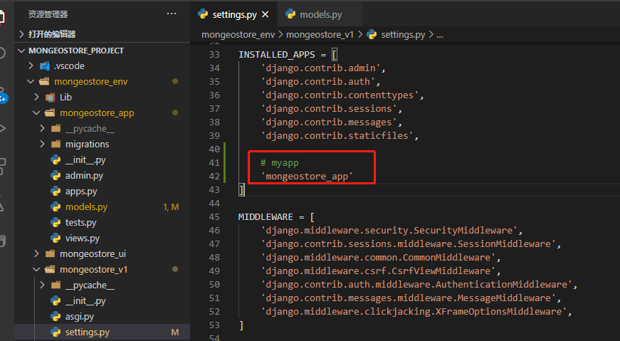
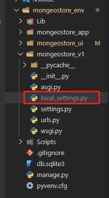
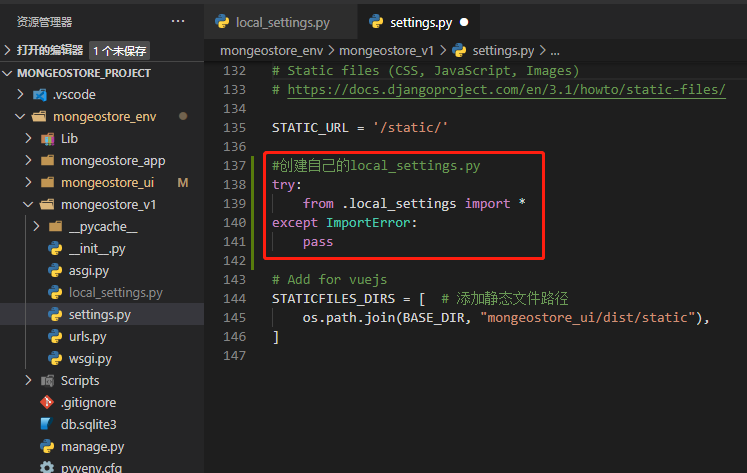
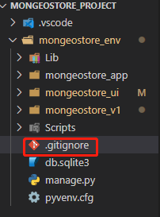

# 系统设计

[TOC]

## 项目方案

### 1、项目开发模式

- 前后端分离
  - 前端框架：Vue3.0
  - 后端框架：Django3.0

### 2、语言及工具版本

- Python3.6

- Django3.0

- MongoDB4.0

### 3、技术要点

- 采用Vue作为前端框架
- 采用Django作为后端框架
- 采用腾讯云通讯短信发送
- DRF视图、序列化
- Captacha、Pillow图片验证
- JWT认证机制

### 4、数据库设计

- 用户AbstractUser
- 数据分类
- 

## 一、Django搭建后端

### 1. 安装Django

```
#创建虚拟环境
virtualenv mongeostore_env

#激活虚拟环境,先切换到目录
cd mongeostore_env

.\Scripts\activate

#安装Django
pip install django
```

### 2. Django中创建项目

- 注意：创建应用必须先进入虚拟环境

```
 django-admin startproject mongeostore_v1
 
 # 补充,最好加个点，不然会在创建一个目录
 django-admin startproject mongeostore_v1 .
  
```


```
项目目录说明：

__init__.py: 说明test1是一个python包。

settings.py: 项目的配置文件。

urls.py: 进行url路由的配置。

wsgi.py:  web服务器和Django交互的入口。

manage.py:  项目的管理文件。
```

###  3. 运行即可

```
python manage.py runserver
```


### 4.创建应用

```
python manage.py startapp mongeostore_app
```

- 在settings.py中添加应用




### 5、本地配置

#### 5.1、创建本地配置

- 创建自己的本地配置local_settings.py，可以设置自己的短信密钥，提交到git，忽略local_settings.py。

  

#### 5.2、在settings.py中导入



```
try:
    from .local_settings import *
except ImportError:
    pass
```

#### 5.3、创建自己的本地配置

```
LANGUAGE_CODE = 'zh-hans'
```

- **切记：给别人的代码时，不给自己的local_settings.py**


### 6、设置git忽略文件

- 在项目根目录创建`.gitignore`文件

  

- 输入忽略的配置

```
#vscode
.vscode/

__pycache__/
*.py[cod]
*$py.class

#Django stuff:
local_settings.py
*.sqlite3
```


## 二、Vue搭建前端

- 安装
  - webpack——打包工具
  - Element——前端框架
  - axios

### 1. 创建项目

- 使用Vue-CLI3搭建

```
vue create mongeostore_ui
```


### 2.启动

```
 $ cd mongeostore_ui
 $ npm run serve
```


