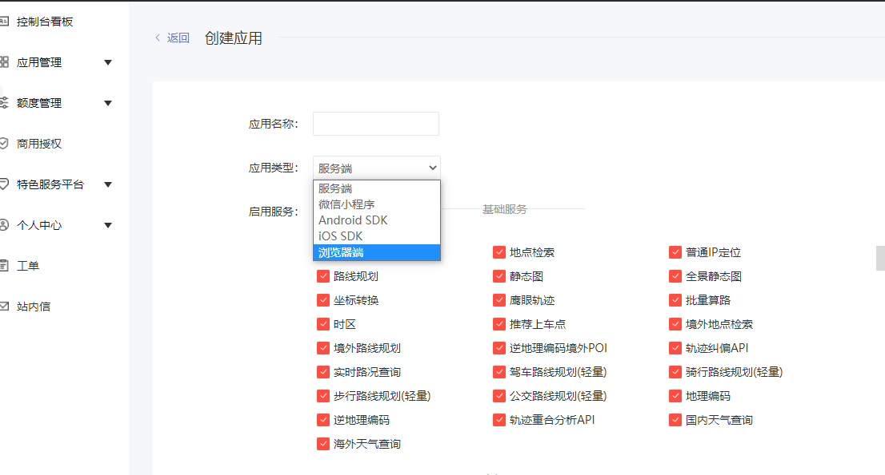
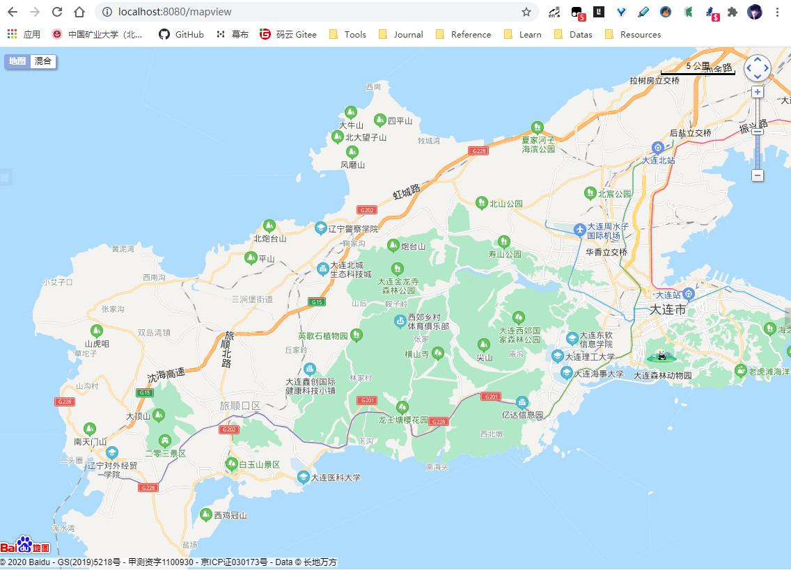

## 百度API使用

[TOC]


### 1、申请AK

访问：https://lbsyun.baidu.com/apiconsole/key#/home


选择使用了类型。我这里使用的式浏览器，按提示申请即可。



### 2、通过模块化引入的方法

参考：https://github.com/Dafrok/vue-baidu-map

#### 2.1 安装

```
npm i vue-baidu-map --save
```

#### 2.2 初始化

在main.js中添加配置

```
import Vue from 'vue'
import BaiduMap from 'vue-baidu-map'

Vue.use(BaiduMap, {
  /* Visit http://lbsyun.baidu.com/apiconsole/key for details about app key. */
  ak: 'YOUR_APP_KEY'
})
```

#### 2.3 使用

新建一个MapView.vue，测试。

```vue
<!--
 * @Description: henggao_learning
 * @version: v1.0.0
 * @Author: henggao
 * @Date: 2020-10-06 17:05:32
 * @LastEditors: henggao
 * @LastEditTime: 2020-10-06 18:45:25
-->
<template>
  <div>
    <el-card class="card-back-color card1">
      <div class="baidu-title">
        <h4>百度地图API</h4>
      </div>
      <baidu-map :center="center" :zoom="zoom" @ready="handler" class="map">
        <bm-scale anchor="BMAP_ANCHOR_TOP_RIGHT"></bm-scale>
        <bm-navigation anchor="BMAP_ANCHOR_TOP_RIGHT"></bm-navigation>
        <bm-map-type
          :map-types="['BMAP_NORMAL_MAP', 'BMAP_HYBRID_MAP']"
          anchor="BMAP_ANCHOR_TOP_LEFT"
        ></bm-map-type>
      </baidu-map>
    </el-card>
  </div>
</template>

<script>
export default {
  name: "mapview",
  data() {
    return {
      center: { lng: 0, lat: 0 },
      zoom: 3
    };
  },

  mounted() {
    this.addPoints();
  },
  methods: {
    handler({ BMap, map }) {
      map.enableScrollWheelZoom(true); //开启鼠标滚轮缩放
      console.log(BMap, map);
      this.center.lng = 121.62;
      this.center.lat = 38.92;
      this.zoom = 11.5;
    }
  }
};
</script>

<style>
/* The container of BaiduMap must be set width & height. */
.map {
  width: 100%;
  height: 500px;
}
</style>

```




官方文档功能很全：https://dafrok.github.io/vue-baidu-map/#/zh/start/installation


## 天地图API

### 1、申请


### 2、使用

#### 2.1 在引入script

- public/index.html引入

```js
<script src="http://api.tianditu.gov.cn/api?v=4.0&tk=您的密钥" type="text/javascript"></script>
```


#### 2.2 使用

```vue
<template>
  <div>
    <header>天地图</header>
    <div
      id="tMapDiv"
      style="position: absolute; width: 100%; height: 100%"
    ></div>
  </div>
</template>


<script>
export default {
  name: "SpatialIndex",
  data() {
    return {};
  },
  mounted: function () {
    this.loadMap();
  },
  methods: {
    loadMap() {
      var map = new T.Map("tMapDiv");
      map.centerAndZoom(new T.LngLat(116.40769, 39.89945), 12);
    },
  },
};
</script>

<style>
</style>
```

#### 2.3 查看

- 浏览器访问

  

  

### 3、模板

#### 3.1 创建模板

- 在components目录下新建一个TdtMap.vue

  ```vue
  <!--
   * @Description: henggao_learning
   * @version: v1.0.0
   * @Author: henggao
   * @Date: 2020-12-06 10:26:42
   * @LastEditors: henggao
   * @LastEditTime: 2020-12-06 11:30:22
  -->
  <template>
    <div>
      <el-row>
        <el-col :span="24">
          <span
            >当前位置：{{ locatInfo.location }}&nbsp;&nbsp;获取时间：{{
              locatInfo.locatTime
            }}&nbsp;&nbsp;经度：{{ locatInfo.lng }}&nbsp;&nbsp;维度：{{
              locatInfo.lat
            }}</span
          >
          <div id="mapDiv" />
        </el-col>
      </el-row>
    </div>
  </template>
  
  <script>
  import axios from "axios";
  export default {
    name: "TdtMap",
    data() {
      return {
        isMobile: false,
        lddialogwidth: "30%",
        locatInfo: {
          location: "暂无数据",
          locatTime: "暂无数据",
          lng: "暂无数据",
          lat: "暂无数据",
        },
        zoom: 12,
        detailLocation: "",
        locationDialogVisible: false,
        locationNow: false,
      };
    },
    watch: {},
    mounted: function () {
      this.onloadMap();
    },
    methods: {
      //加载天地图
      onloadMap: function () {
        var map;
  
        // 天地图key
        const mapKey = "9c117468801c8405aaddff93da98c1e6";
  
        // 初始化地图对象
        map = new T.Map("mapDiv");
  
        // 设置显示地图的中心点和级别
        map.centerAndZoom(new T.LngLat(116.40969, 38.89945), this.zoom);
  
        // 创建地图类型控件对象
        var _mapType = new T.Control.MapType();
  
        // 添加地图类型控件
        map.addControl(_mapType);
  
        // 创建缩放平移控件对象
        var _zoomControl = new T.Control.Zoom();
  
        // 添加缩放平移控件
        map.addControl(_zoomControl);
  
        // 创建缩放平移控件对象
        _zoomControl.setPosition(T_ANCHOR_TOP_LEFT);
  
        // 创建定位对象lo
        var lo = new T.Geolocation();
  
        // 创建右键菜单对象
        var menu = new T.ContextMenu({
          width: 140,
        });
  
        // 添加右键菜单
        var txtMenuItem = [
          {
            text: "放大",
            callback: () => {
              map.zoomIn();
            },
          },
          {
            text: "缩小",
            callback: () => {
              map.zoomOut();
            },
          },
          {
            text: "放置到最大级",
            callback: () => {
              map.setZoom(18);
            },
          },
          {
            text: "查看全国",
            callback: () => {
              map.setZoom(4);
            },
          },
          {
            text: "获得右键点击处坐标",
            isDisable: false,
            callback: (lnglat) => {
              alert(lnglat.getLng() + "," + lnglat.getLat());
            },
          },
        ];
  
        for (var i = 0; i < txtMenuItem.length; i++) {
          // 添加菜单项
          var item = new T.MenuItem(txtMenuItem[i].text, txtMenuItem[i].callback);
          // item.disable();
          menu.addItem(item);
          if (i === 1 || i === 3) {
            // 添加分割线
            menu.addSeparator();
          }
        }
  
        // 装载菜单
        map.addContextMenu(menu);
  
        // 定位结果回调函数
        function fn(e) {
          // 当前为移动端时
          if (this.getStatus() === 0) {
            map.centerAndZoom(e.lnglat, 15);
            console.log(e);
            // 获取地理位置信息并设置到标注
            getDetailLocation(e.lnglat, e.lnglat);
          }
  
          // 当前为PC端时
          if (this.getStatus() === 1) {
            map.centerAndZoom(e.lnglat, e.level);
            console.log(e);
            // 获取地理位置信息并设置到标注
            getDetailLocation(e.lnglat, e.lnglat);
          }
        }
  
        // 设置标注
        function setMarker(e, d) {
          var marker = new T.Marker(e);
          map.addOverLay(marker);
          var markerInfoWin = new T.InfoWindow("" + d);
          marker.addEventListener("click", function () {
            marker.openInfoWindow(markerInfoWin);
          });
        }
  
        // 暂存this
        const _this = this;
  
        // 通过经纬度获取详细地址
        function getDetailLocation(lnglat_lng, lnglat_lat) {
          axios
            .get("https://api.tianditu.gov.cn/geocoder", {
              params: {
                tk: mapKey,
                type: "geocode",
                postStr:
                  "{'lon':" +
                  lnglat_lng.lng +
                  ",'lat':" +
                  lnglat_lat.lat +
                  ",'ver':1}",
              },
            })
            .then((data) => {
              var addressdata = data.data;
              console.log(addressdata);
              var detaillocation = addressdata.result.formatted_address;
              console.log(detaillocation);
  
              // // 截取地址信息显示
              _this.locatInfo.location = addressdata.result.formatted_address;
              // 获取定位时间
              _this.locatInfo.locatTime = new Date().toLocaleDateString();
              _this.locatInfo.lng = lnglat_lng.lng;
              _this.locatInfo.lat = lnglat_lat.lat;
              console.log(new Date().toLocaleDateString());
              console.log(lnglat_lng.lng);
              console.log(lnglat_lat.lat);
              if (addressdata.msg == "ok" && addressdata.status == 0) {
                // 将位置信息设置到标注
                setMarker(lnglat_lat, detaillocation);
              } else {
                // 错误处理
              }
            })
            .catch((error) => {
              console.log(error);
            });
        }
  
        // 开始定位
        lo.getCurrentPosition(fn);
      },
    },
  };
  </script>
  <style lang="scss" scoped>
  #mapDiv {
    position: absolute;
    z-index: 1;
    width: 100%;
    height: 885px;
  }
  .spanp {
    line-height: 1.5rem;
  }
  </style>
  
  ```

#### 3.2 使用模板

- `SpatialIndex.vue`使用

```vue
<template>
  <!-- 使用组件 -->
  <TdtMap />
</template>

<script>
/* 导入组件 */
import TdtMap from "@/components/TdtMap";

export default {
  name: "SpatialIndex",
  components: {
    /* 注册组件 */
    TdtMap,
  },
  data() {
    return {};
  },
  created() {},
  mounted() {},
  watch: {},
  methods: {},
};
</script>

<style scoped>
</style>

```


- [ref](https://blog.csdn.net/qq_41912398/article/details/108311876?utm_medium=distribute.pc_relevant.none-task-blog-BlogCommendFromMachineLearnPai2-6.control&depth_1-utm_source=distribute.pc_relevant.none-task-blog-BlogCommendFromMachineLearnPai2-6.control)