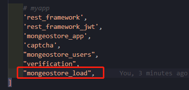

# Vue使用Plupload上传插件实现文件切片上传

[原文链接](https://blog.csdn.net/Bug_MakerQAQ/article/details/105835492?utm_medium=distribute.pc_relevant.none-task-blog-BlogCommendFromMachineLearnPai2-1.edu_weight&depth_1-utm_source=distribute.pc_relevant.none-task-blog-BlogCommendFromMachineLearnPai2-1.edu_weight)

**Element原生的上传组件很好用，但是不支持分片上传功能，在上传大文件的过程中，直接上传可能因为接口访问时间过长上传中断导致文件上传失败，所以使用Plupload插件来实现文件上传功能。**

用到的插件：
1、Plupload（实现文件分片上传）
2、axios（如果需要额外的调用接口可以使用，我的是需要获取uuid，才额外引用的）
3、Element（样式实现）

npm安装plupload：
npm install --save plupload

代码：

```javascript
<template>
  <div style="padding-top:20px;">
    <el-button ref="VideoChose" id="VideoChose" size="mini">选择文件</el-button>
    <el-button ref="VideoChose" type="primary"  size="mini" @click="FileUplodeOn">开始上传</el-button>
    <el-card style="margin-top:20px;">
      <el-table :data="fileList" style="width: 100%">
        <el-table-column prop="id" label="文件id"></el-table-column>
        <el-table-column prop="name" label="文件名称"></el-table-column>
        <el-table-column prop="type" label="文件类型"></el-table-column>
        <el-table-column prop="size" label="文件大小" v-slot="{row}">
          {{row.size}}MB
        </el-table-column>
        <el-table-column label="进度" v-slot="{row}">
          <el-progress :text-inside="true" :stroke-width="16" :percentage="row.percentage"></el-progress>
        </el-table-column>
        <el-table-column label="取消上传" v-slot="{row}">
          <el-button
            type="danger"
            icon="el-icon-delete"
            size="mini"
            circle
            @click="removeFile(row.id)"
          ></el-button>
        </el-table-column>
        <el-table-column label="上传状态" v-slot="{row}">
          <el-link
            :type="row.loadType==0?'info':row.loadType==1?'warning':row.loadType==2?'success':'danger'"
            :underline="false"
          >{{row.loadType==0?'等待上传':row.loadType==1?'正在上传':row.loadType==2?'上传成功':'上传失败'}}</el-link>
        </el-table-column>
      </el-table>
    </el-card>
  </div>
</template>

<script>
import plupload from "plupload";
import axios from "axios";
export default {
  data() {
    return {
      show: false,
      fileList: [],
      fileOptions: {
        browse_button: "VideoChose",
        url: "你的url",
        flash_swf_url: "script/Moxie.swf",
        silverlight_xap_url: "script/Moxie.xap",
        chunk_size: "1mb",
        max_retries: 3,
        unique_names: true,
        multi_selection: true,
        views: {
          list: true,
          thumbs: true, // Show thumbs
          active: "thumbs"
        },
        filters: {
          mime_types: [
            //文件格式
            {
              title: "movie files",
              extensions: "mp4,rmvb,mpg,mxf,avi,mpeg,wmv,flv,mov,ts" //文件格式
            }
          ],
          max_file_size: "1024mb", //最大上传的文件
          prevent_duplicates: true //不允许选取重复文件
        },
        multipart_params: {
          uuid: "" //参数
        }
      }
    };
  },

  mounted() {
    //实例化一个plupload上传对象
    this.uploader.init();
    //绑定进队列
    this.uploader.bind("FilesAdded", this.FilesAdded);
    //绑定进度
    this.uploader.bind("UploadProgress", this.UploadProgress);
    //上传之前
    this.uploader.bind("BeforeUpload", this.BeforeUpload);
    //上传成功监听
    this.uploader.bind("FileUploaded", this.FileUploaded);
    //获取uuid
    axios.get("你的url").then(({ data }) => {
      this.fileOptions.multipart_params.uuid = data;
    });
  },
  computed: {
    //实例化一个plupload上传对象
    uploader() {
      return new plupload.Uploader(this.fileOptions);
    }
  },
  methods: {
    //绑定进队列
    FilesAdded(uploader, files) {
      let objarr = files.map((val, ind) => {
        let obj = {};
        obj.id = val.id;
        obj.name = val.name;
        obj.type = val.type;
        obj.size = parseInt((val.origSize / 1024 / 1024) * 100) / 100;
        obj.percentage = 0;
        obj.loadType = 0;
        return obj;
      });
      this.fileList.push(...objarr);
    },
    //上传之前回调
    BeforeUpload(uploader, file){
      this.fileList = this.fileList.map((val, ind) => {
        if (val.id == file.id) {
          val.loadType = 1;
        }
        return val;
      });
    },
    //上传进度回调
    UploadProgress(uploader, file) {
      this.fileList = this.fileList.map((val, ind) => {
        if (val.id == file.id) {
          val.percentage = file.percent;
        }
        return val;
      });
    },
    // 上传成功回调
    FileUploaded(uploader, file, responseObject) {
      this.fileList = this.fileList.map((val, ind) => {
        if (val.id == file.id) {
          if (JSON.parse(responseObject.response).status == 0) {
            val.loadType = 2;
          } else {
            val.loadType = 3;
          }
        }
        return val;
      });
    },
    //取消上传回调
    removeFile(id) {
      this.uploader.removeFile(id);
      this.fileList = this.fileList.filter((val, ind) => {
        if (val.id == id) {
          return false;
        } else {
          return true;
        }
      });
    },
    //开始上传
    FileUplodeOn() {
      this.uploader.start(); 
    }
  }
};
</script>
```


## vue-simple-upload

参考：http://blog.gqylpy.com/gqy/16543/

### 1、安装

```shell
npm install vue-simple-uploader --save

# 使用md5 需要安装
npm install --save spark-md5
```

### 2、main.js配置

```js
import uploader from 'vue-simple-uploader'
Vue.use(uploader)
```

### 3、Vue部分

```vue

```


## 后端

1、创建上传模块

```
python manage.py startapp mongeostore_load
```

2、在settings.py中添加应用



3、在根目录mongeostore_v1中urls.py中设置


4、


