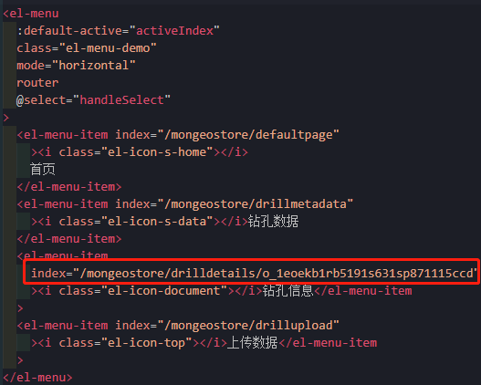
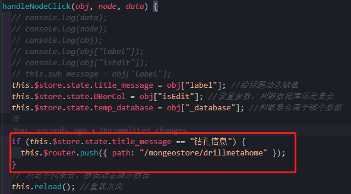

# Router的使用

[TOC]

## 前言

- 子导航使用BootStrap中模板时，发现页面可以跳转，但浏览器地址不发生改变，这导致自己无法设置连接跳转到相应组件；
- 这里换为Element导航，结合router，可以实现功能；


## 一、总子组件

- 将路由放在这个总的子组件`DrillMetaInfo.vue`中；
- 要实现的功能：点击DrillMetaData中详情链接，跳到DrillDetails中查看详细信息；

### 1、前端

- 备份一下DrillMetaInfo copy.vue

- 使用Element导航模板，配置router/index.js

- MonGeoStore.vue保持不变，把任务交给子组件`DrillMetaInfo.vue`

- `DrillMetaInfo.vue`

  ```vue
  <!--
   * @Description: henggao_learning
   * @version: v1.0.0
   * @Author: henggao
   * @Date: 2020-12-01 08:57:34
   * @LastEditors: henggao
   * @LastEditTime: 2020-12-02 10:38:06
  -->
  
  <template>
    <!-- 主界面-->
    <div class="maincontent">
      <!-- 子导航 -->
      <el-container>
        <el-header class="maincontent_header">
          <!-- <nav>
            <div
              class="nav nav-tabs"
              id="nav-tab"
              role="tablist"
              style="min-width: 1100px"
            >
              <a
                class="nav-item nav-link active"
                id="nav-home-tab"
                data-toggle="tab"
                href="#nav-home"
                role="tab"
                aria-controls="nav-home"
                aria-selected="true"
                ><i class="el-icon-s-home"></i>首页</a
              >
              <a
                class="nav-item nav-link"
                id="nav-profile-tab"
                data-toggle="tab"
                href="#nav-profile"
                role="tab"
                aria-controls="nav-profile"
                aria-selected="false"
                ><i class="el-icon-s-data"></i>钻孔数据</a
              >
              <a
                class="nav-item nav-link"
                id="nav-metadata-tab"
                data-toggle="tab"
                href="#nav-metadata"
                role="tab"
                aria-controls="nav-metadata"
                aria-selected="false"
                ><i class="el-icon-document"></i>钻孔信息</a
              >
              <a
                class="nav-item nav-link"
                id="nav-uploadfile-tab"
                data-toggle="tab"
                href="#nav-uploadfile"
                role="tab"
                aria-controls="nav-uploadfile"
                aria-selected="false"
                ><i class="el-icon-top"></i>上传数据</a
              >
            </div>
          </nav> -->
          <el-menu
            :default-active="activeIndex"
            class="el-menu-demo"
            mode="horizontal"
            router
            @select="handleSelect"
          >
            <el-menu-item index="/mongeostore/defaultpage"
              ><i class="el-icon-s-home"></i>
              首页
            </el-menu-item>
            <el-menu-item index="/mongeostore/drillmetadata"
              ><i class="el-icon-s-data"></i>钻孔数据
            </el-menu-item>
            <el-menu-item index="/mongeostore/drilldetails/1"
              ><i class="el-icon-document"></i>钻孔信息</el-menu-item
            >
            <el-menu-item index="/mongeostore/drillupload"
              ><i class="el-icon-top"></i>上传数据</el-menu-item
            >
          </el-menu>
        </el-header>
        <el-main>
          <router-view></router-view>
        </el-main>
      </el-container>
    </div>
  </template>
  
  <script>
  import MapView from "@/views/MapView.vue";
  import Home from "@/views/Home.vue";
  import UploadFile from "@/views/UploadFile.vue";
  import UploadCSV from "@/views/UploadCSV.vue";
  import UploadExcel from "@/views/UploadExcel.vue";
  import SeiTable from "@/components/SeiTable.vue";
  import CommonData from "@/components/CommonData.vue";
  import CommonUploadExcel from "@/components/CommonUploadExcel.vue";
  import CommonUploadCSV from "@/components/CommonUploadCSV.vue";
  import InclinationData from "@/components/drill/InclinationData.vue";
  import DrillDetails from "@/components/drill/DrillDetails.vue";
  import DrillMetaData from "@/components/drill/DrillMetaData.vue";
  import DrillUpload from "@/components/drill/DrillUpload.vue";
  export default {
    name: "DrillMetaInfo",
    components: {
      MapView,
      Home,
      SeiTable,
      UploadFile,
      UploadCSV,
      UploadExcel,
      CommonData,
      CommonUploadExcel,
      CommonUploadCSV,
      InclinationData,
      DrillDetails,
      DrillMetaData,
      DrillUpload,
    },
    data() {
      return {
        activeIndex: "1",
      };
    },
    methods: {
      handleSelect(key, keyPath) {
        console.log(key, keyPath);
      },
    },
  };
  </script>
  
  <style lang="scss" scoped>
  // .maincontent {
  //   // height: 821px;
  //   // height: 850px;
  // }
  /* 导航子标题 */
  .maincontent_header {
    /* 固定高度 */
    height: 46px !important;
    /* 消除边距 */
    padding: 0;
    // 固定内容
  }
  /* maincontent子导航 */
  .maincontent div#nav-tab {
    height: 46px;
    /* width: 100%; */
    /* background-color: rgba(21, 132, 197, 0.5); */
    background-color: #870000;
    /* position: static; */
  }
  /* maincontent子导航 字体 */
  .maincontent div#nav-tab a {
    color: #ac8585;
  }
  // div#nav-tabContent {
  //   // height: 775px;
  //   // height: 780px;
  // }
  .el-menu-demo {
    height: 46px;
    background-color: #870000;
  }
  .el-menu-demo .el-menu-item {
    font-size: 20px;
    color: #b47777;
  }
  .el-menu--horizontal > .el-menu-item {
    float: left;
    height: 46px;
    line-height: 46px;
    margin: 0;
  }
  </style>
  ```

  - 修改时候注意默认页面的跳转

    

  

- router/index.js

  ```js
  {
      path: "/mongeostore",
      name: "MonGeoStore",
      component: () =>
        import(/* webpackChunkName: "about" */ "@/views/MonGeoStore.vue"),
      children: [
        {
          path: "defaultpage",
          name: "DefaultPage",
          component: () =>
            import(/* webpackChunkName: "about" */ "@/components/DefaultPage.vue")
        },
  
        {
          path: "drillmetadata",
          name: "DrillMetaData",
          component: () =>
            import(/* webpackChunkName: "about" */ "@/components/drill/DrillMetaData.vue")
        },
        {
          path: "drilldetails/:_id",
          name: "DrillDetails",
          component: () =>
            import(/* webpackChunkName: "about" */ "@/components/drill/DrillDetails.vue")
        },
        {
          path: "drillupload",
          name: "DrillUpload",
          component: () =>
            import(/* webpackChunkName: "about" */ "@/components/drill/DrillUpload.vue")
        },
  
      ]
    },
  ```

  

- `DrillMetaInfo.vue`

  - 这里注意router-link中to的使用

  ```vue
   <template slot-scope="scope">
                  <!-- <a
                    :href="'drilldetails/' + scope.row._id"
                    target="_blank"
                    class="buttonText"
                    >查看详情</a
                  > -->
                  <!-- to='/mongeostore/drilldetails' -->
                  <!-- <router-link
                    tag="a"
                    :to="{
                      path: '/mongeostore/drilldetails/',
                      query: { _id: scope.row._id },
                    }"
                    >查看详情</router-link
                  > -->
                  <router-link
                    tag="a"
                    :to="{
                      path: '/mongeostore/drilldetails/' + scope.row._id,
                    }"
                    >查看详情</router-link
                  >
                </template>
  ```

  

- [ref](https://blog.csdn.net/qq_38543537/article/details/80350107?utm_medium=distribute.pc_relevant.none-task-blog-baidulandingword-3&spm=1001.2101.3001.4242)

- [ref](https://juejin.cn/post/6844903806979801095)


### 2、后端

- views.py

  ```python
  # 钻孔详细信息展示,DrillDetails.vue
  class DrillHistogramView(APIView):
  
      def get(self, request, *args, **kwargs):
          # drill_obj = DrillMetaModel.objects.all().order_by('_id')  # 一定要排序
          # queryset = InclinationMetaModel.objects.using('drill').all()
          print(request.GET)
          query_id = request.GET['_id']
          # drill_obj2 = DrillMetaModel.objects.get(
          #     _id='o_1eoemr4ij3iq1t0h12helgk9t11l')
          drill_obj = DrillMetaModel.objects.get(
              _id=query_id)
          print(drill_obj)
          content = drill_obj.zk_histogram.read()
          # pic_data = base64.b64encode(content)  # 图片base64
  
          info = {
              'pic_data': content, # 图片
              '钻孔编号': drill_obj.zk_num,
              '钻孔柱状图': '',
              '钻孔类型': drill_obj.zk_type,
              '终孔深度': drill_obj.final_depth,
              '终孔时间': str(drill_obj.final_date),
              '项目名称': drill_obj.project_name,
              '单位名称': drill_obj.company_name,
              '上传时间': str(drill_obj.upload_date),
              '上传人员': drill_obj.uploader,
          },
  
          data = dumps(info)  # 这个地方要用字符串传到前端去
          return HttpResponse(data)
  ```

  

### 小插曲

- 当我们点击时，需要设置钻孔信息的首页，这主要是侧边树形结构没有绑定路由。

- 解决方式

  - 我在树形结构处进行判断，对应字段绑定上路由地址。如果是Element导航，比较简单了。

  - SideTree.vue

    ```js
    if (this.$store.state.title_message == "钻孔信息") {
            this.$router.push({ path: "/mongeostore/drillmetahome" });
          }
    ```

    

- :tipping_hand_man:这里path如果不加`/`，默认地址追加，加上是从跟路径。

- 关于动态路由
  - [ref](https://www.hangge.com/blog/cache/detail_2718.html)
  - [ref](https://blog.csdn.net/tly599167/article/details/107378249)
  - [ref](https://www.shuzhiduo.com/A/B0zqa8A3zv/)
  - [ref](https://www.shuzhiduo.com/R/mo5kxQ9ndw/)