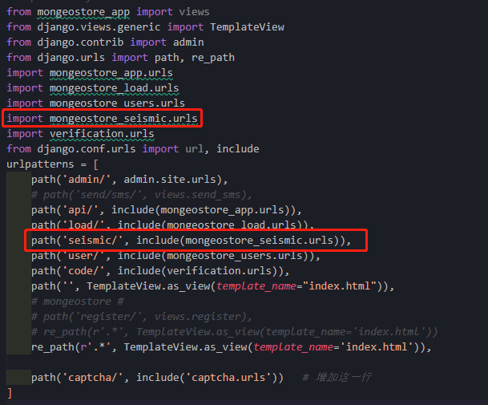

# Segy数据

[TOC]

## 准备

- segyio
- mongoengine


## 一、数据读取

- 读取道到的数据时numpy.ndarray，需要转换为list

```python
from mongoengine import connect
from mongoengine.document import Document
from mongoengine.fields import FloatField, IntField, ListField, PointField, StringField
from mongoengine import *
from mongoengine.context_managers import switch_collection, switch_db

connect(alias='drill_system', db='钻孔数据管理子系统',
        host='192.168.55.110', port=20000)
connect(alias='rs_system', db='遥感数据管理子系统', host='192.168.55.110', port=20000)


class SegyData(Document):
    name = StringField(required=True, max_length=200)
    age = IntField(required=True)
    location = ListField()
    meta = {'db_alias': 'rs_system'}


with switch_collection(SegyData, 'group2000') as SegyData:
    # Users(name='hello Group 2000 collection!').save()  # 将数据保存至 group2000 集合
    # Users(name='Ross').save()  # ===》 这时会将数据保存至 'archive-user-db'

    import segyio
    content = ".\mongeostore_env\mytest\LX_SEGY2.segy"
    with segyio.open(content, mode="r", strict=False, ignore_geometry=False, endian='big') as f:
        datatest = f.trace[0]  #拿到segy中数据
        datatest1 = f.trace[1]  #拿到segy中数据
        datalist = datatest.tolist() #将<class 'numpy.ndarray'>转为list
        datalist1 = datatest1.tolist() #将<class 'numpy.ndarray'>转为list

        user1 = SegyData(
            name='segy1',
            age=2001,
            location=[datalist,datalist1]
        )
        user1.save()
        print(user1.name)
        print(user1.location)
    # user1.name = 'zz11'
    # user1.save()
    # print(user1.name)
```


## 二、创建应用

### 1、虚拟目录下创建应用

```
python manage.py startapp mongeostore_seismic
```

### 2、settings.py

```
INSTALLED_APPS = [
	"mongeostore_seismic",
]
```

### 3、新建urls.py

- 3.1、新建mongoestore_seismic/urls.py

- 3.2、在工程目录mongeostore_v1/urls.py下注册




### 4、新建serializers.py

- 用于序列化

