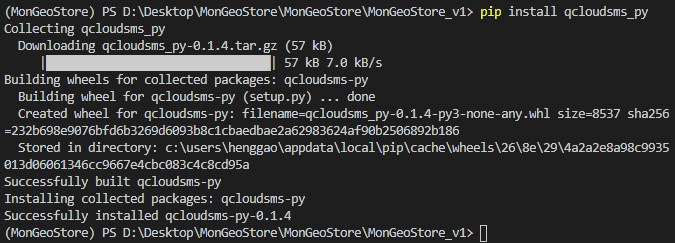
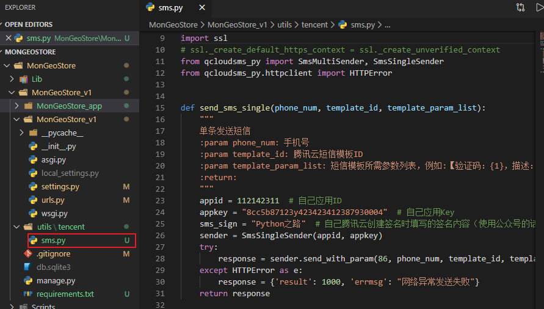
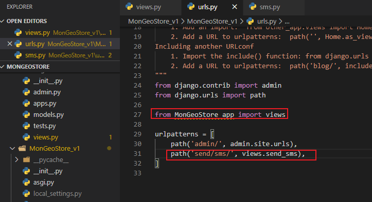
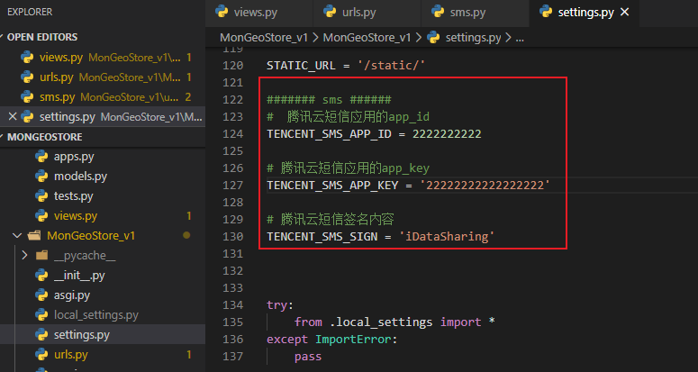
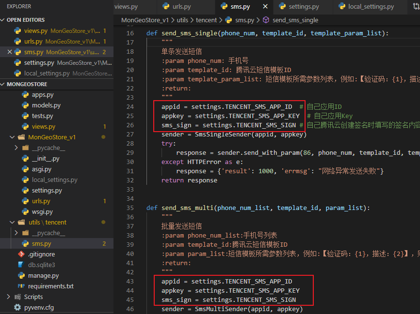
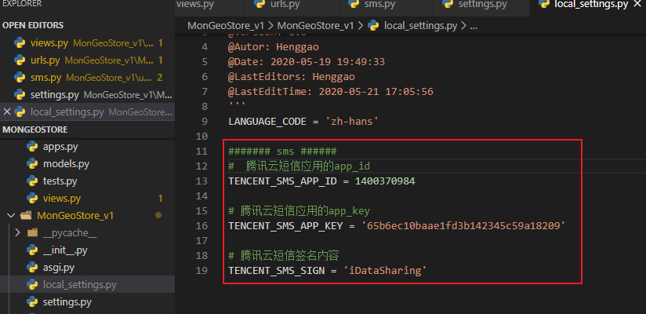

# Python短信验证
[TOC]

## 1. 开始使用Python发送短信。

### 1. 安装SDK

```
pip install qcloudsms_py
```



### 2.基于SDK发短信

#### 2.1 新建文件utils/tencent/sms.py



- sms.py

```python
import ssl
# ssl._create_default_https_context = ssl._create_unverified_context
from qcloudsms_py import SmsMultiSender, SmsSingleSender
from qcloudsms_py.httpclient import HTTPError
def send_sms_single(phone_num, template_id, template_param_list):
    """
    单条发送短信
    :param phone_num: 手机号
    :param template_id: 腾讯云短信模板ID
    :param template_param_list: 短信模板所需参数列表，例如:【验证码：{1}，描述：{2}】，则传递参数 [888,666]按顺序去格式化模板
    :return:
    """
    appid = 112142311  # 自己应用ID
    appkey = "8cc5b87123y423423412387930004"  # 自己应用Key
    sms_sign = "Python之路"  # 自己腾讯云创建签名时填写的签名内容（使用公众号的话这个值一般是公众号全称或简称）
    sender = SmsSingleSender(appid, appkey)
    try:
        response = sender.send_with_param(86, phone_num, template_id, template_param_list, sign=sms_sign)
    except HTTPError as e:
        response = {'result': 1000, 'errmsg': "网络异常发送失败"}
    return response
def send_sms_multi(phone_num_list, template_id, param_list):
    """
    批量发送短信
    :param phone_num_list:手机号列表
    :param template_id:腾讯云短信模板ID
    :param param_list:短信模板所需参数列表，例如:【验证码：{1}，描述：{2}】，则传递参数 [888,666]按顺序去格式化模板
    :return:
    """
    appid = 112142311
    appkey = "8cc5b87123y423423412387930004"
    sms_sign = "Python之路"
    sender = SmsMultiSender(appid, appkey)
    try:
        response = sender.send_with_param(86, phone_num_list, template_id, param_list, sign=sms_sign)
    except HTTPError as e:
        response = {'result': 1000, 'errmsg': "网络异常发送失败"}
    return response
```

#### 2.2 添加一个视图函数

- MonGeoStore_v1/urls.py

  ```
  from django.contrib import admin
  from django.urls import path
  
  from MonGeoStore_app import views
  
  urlpatterns = [
      path('admin/', admin.site.urls),
      path('send/sms/', views.send_sms),
  ]
  ```

  

- MonGeoStore_app/views.py

  ```python
  from django.shortcuts import render, HttpResponse
  import random 
  from utils.tencent.sms import send_sms_single
  
  # Create your views here.
  def send_sms(request):
      '''发送短信'''
      code = random.randrange(1000,9999)
      res = send_sms_single('15351818127',611200,[code,])
      print(res)
      return HttpResponse('Success')
  ```

#### 2.3 配置文件

- settings.py，设置默认参数

```
####### sms ######
#  腾讯云短信应用的app_id
TENCENT_SMS_APP_ID = 2222222222

# 腾讯云短信应用的app_key
TENCENT_SMS_APP_KEY = '22222222222222222'

# 腾讯云短信签名内容
TENCENT_SMS_SIGN = 'iDataSharing'
```



- 修改对应的sms.py

```
'''
@Description: 
@Version: 1.0
@Autor: Henggao
@Date: 2020-05-20 18:41:42
@LastEditors: Henggao
@LastEditTime: 2020-05-21 17:07:41
'''
import ssl
# ssl._create_default_https_context = ssl._create_unverified_context
from qcloudsms_py import SmsMultiSender, SmsSingleSender
from qcloudsms_py.httpclient import HTTPError

from django.conf import settings

def send_sms_single(phone_num, template_id, template_param_list):
    """
    单条发送短信
    :param phone_num: 手机号
    :param template_id: 腾讯云短信模板ID
    :param template_param_list: 短信模板所需参数列表，例如:【验证码：{1}，描述：{2}】，则传递参数 [888,666]按顺序去格式化模板
    :return:
    """
    appid = settings.TENCENT_SMS_APP_ID  # 自己应用ID
    appkey = settings.TENCENT_SMS_APP_KEY  # 自己应用Key
    sms_sign = settings.TENCENT_SMS_SIGN # 自己腾讯云创建签名时填写的签名内容（使用公众号的话这个值一般是公众号全称或简称）
    sender = SmsSingleSender(appid, appkey)
    try:
        response = sender.send_with_param(86, phone_num, template_id, template_param_list, sign=sms_sign)
    except HTTPError as e:
        response = {'result': 1000, 'errmsg': "网络异常发送失败"}
    return response


def send_sms_multi(phone_num_list, template_id, param_list):
    """
    批量发送短信
    :param phone_num_list:手机号列表
    :param template_id:腾讯云短信模板ID
    :param param_list:短信模板所需参数列表，例如:【验证码：{1}，描述：{2}】，则传递参数 [888,666]按顺序去格式化模板
    :return:
    """
    appid = settings.TENCENT_SMS_APP_ID 
    appkey = settings.TENCENT_SMS_APP_KEY
    sms_sign = settings.TENCENT_SMS_SIGN
    sender = SmsMultiSender(appid, appkey)
    try:
        response = sender.send_with_param(86, phone_num_list, template_id, param_list, sign=sms_sign)
    except HTTPError as e:
        response = {'result': 1000, 'errmsg': "网络异常发送失败"}
    return response

```



- 设置本地配置localsettings.py

```
LANGUAGE_CODE = 'zh-hans'

####### sms ######
#  腾讯云短信应用的app_id
TENCENT_SMS_APP_ID = 1400370984

# 腾讯云短信应用的app_key
TENCENT_SMS_APP_KEY = '65b6ec10baae1fd3b142345c59a18209'

# 腾讯云短信签名内容
TENCENT_SMS_SIGN = 'iDataSharing'
```



- 运行程序

  注意在虚拟环境下，运行

  ```
  python manage.py runserver
  ```

  

访问网址：http://127.0.0.1:8000/send/sms/


成功收到短信！

终端返回如下

