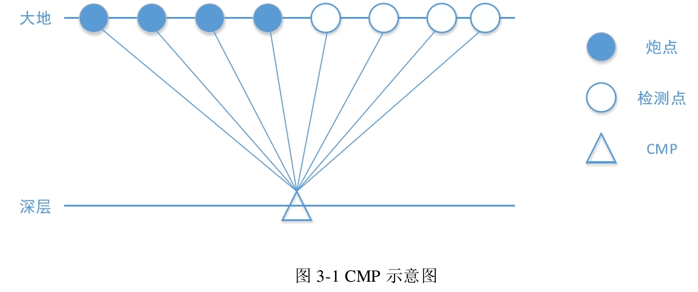
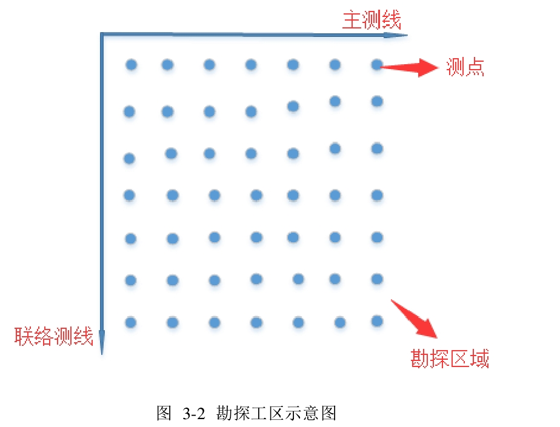
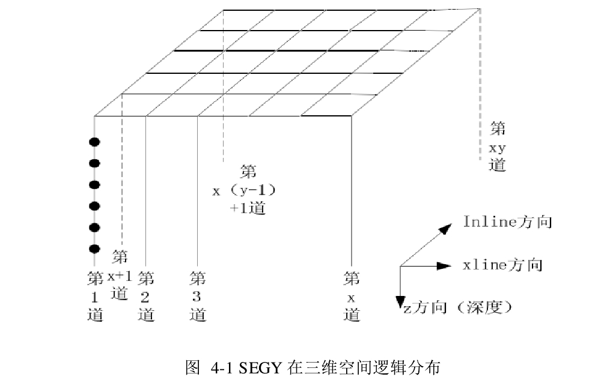
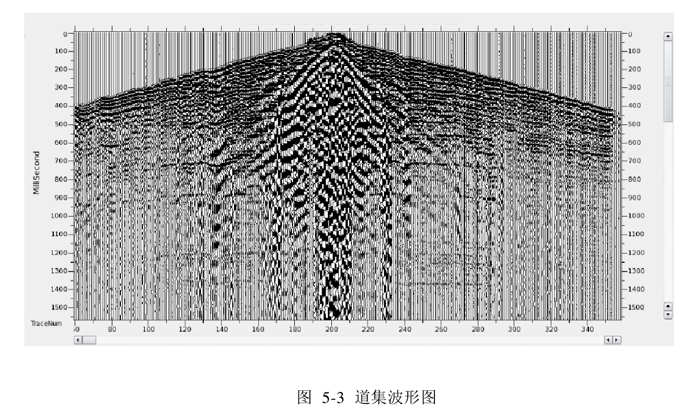
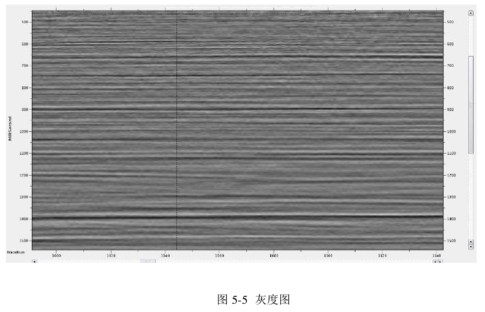
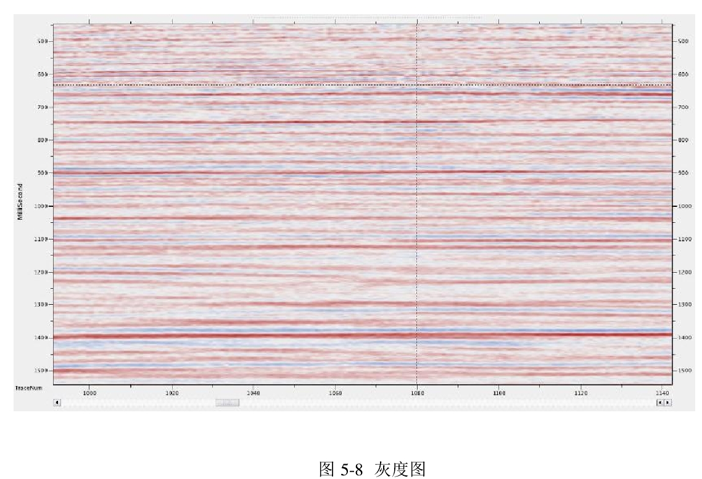
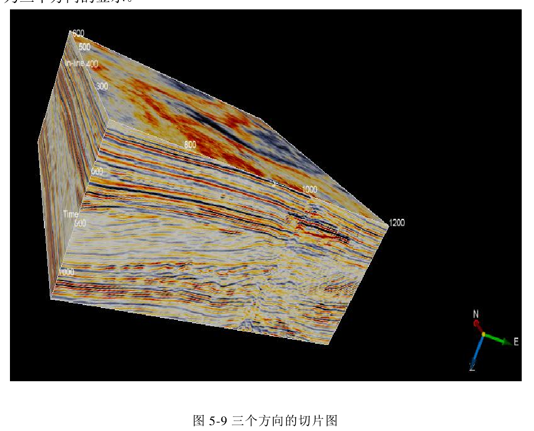
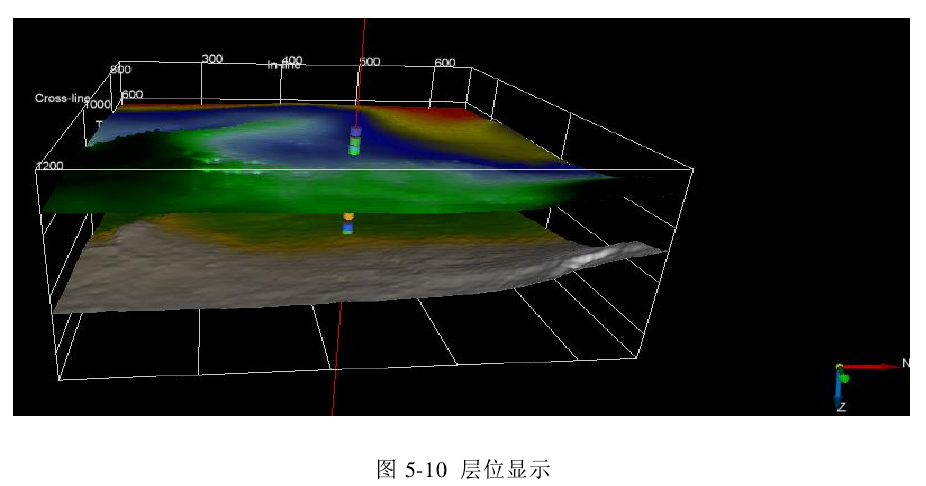
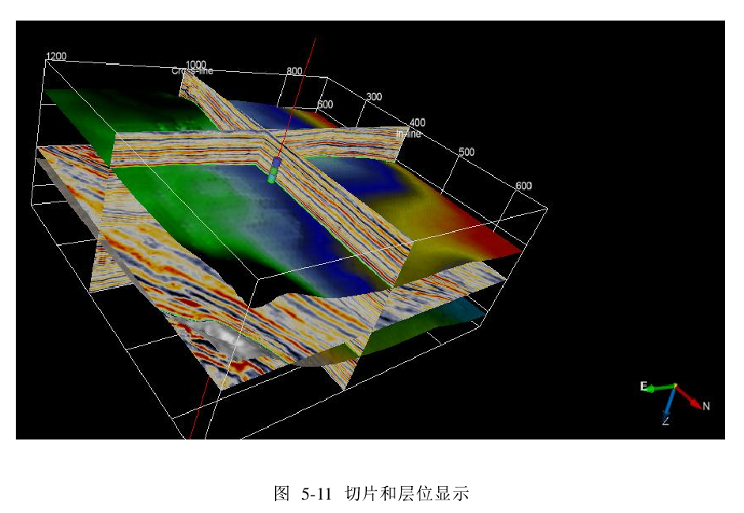

[TOC]

## 文献阅读

### 基于MongoDB的滇池流域非点源污染模拟时空数据库管理系统设计与实现

- 2015.5.30

- 实现时空数据空间特征、属性特征、时间特征一体化存储

- 以达到用户高并发、高可用需求

  

- 对时空数据库的研究包括：
  - （1）时空数据模型：研究如何设计数据结构，高效组织、存储时空数据[11]。
  - （2）时空分析和推理：根据地理过程变化规律，从大量的时间序列数据和空间数据分析地理现象发展规律。建立模型，通过时间推理和空间推理预测研究区域发展变化趋势[12]。
  - （3）时空数据库查询系统：设计新的数据库查询时间和空间特征语法[13]。
  - （4）时空数据的可视化；着重探讨在不同时间点的空间数据如何显示，产生动态变化的效果，生动直观反映地理变化规律以及如何高效制图与地理数据符号化等问题。
- 数据库管理平台规定了时空数据在MongoDB数据库中如何存储、组织、提供不同来源、格式的数据如何导入导出等功能，并提供高效地存储与查询检索功能以及数据的维护与管理功能。

- 空间数据库管理系统（Spatial database management system，SDBMS）是指以特定结构和数据模型（如关系模型，面向对象模型等）表示空间信息，从而对地理空间的中的地理信息进行存储、访问和管理的数据库。空间数据库操作对象集合和图层，通过查询返回结果。

- 数据库管理系统（DBMS）也可以处理存储在如磁盘、光盘等二级设备上的海量空间数据，并完成特殊的索引以及查询处理等任务。空间数据库管理系统是用来管理存储在数据库中的空间数据和非空间数据数据的数据库管理系统。空间数据库管理系统的主要特点为：支持空间数据模型、能够调用空间类型的查询语言；支持空间索引，空间操作算法是有效的和具体的查询优化规则[29]。 

- 空间数据十分复杂和特殊，具有以下重要特点： 

  - 1）空间特征
  - 2）非结构化特征
  - 3）时间特征
  - 4）多尺度特征

- 时空立方体模型有两种表示方法：一是利用三维地理矩阵的行、列和高分别表示空间信息、属性信息和时间信息。二是利用用四叉树对二维数据进行表达，八叉树立方体结构对三维信息进行表达，十六叉树表达GIS的空间—时间模型。

- MongoDB 最大的特点是它支持的查询语法非常强大，其语言就像面向对象的查询语法，可实现绝大部分关系数据库单表的查询功能，并且能建立数据库索引[42]

- GDAL、OGR

- 云计算

  - 云计算把网络中各种硬件和软件资源集中起来，统一管理其存储空间、计算能力以及软件服务，并把这些资源放在可伸缩的虚拟资源池上，根据用户需要供给其配额使用。

    

### 基于 MongoDB 的行为—事件的地理时空数据模型构建方法研究

- 2019.6

- 对多维时空特性的地理特征模型框架的时间、空间和属性三个维度，缺少对**事件维度**的描述。

- MongoDB 本身具备时间段的查询功能，但是数据量过大的话，查询速度还是有所减慢，因此需要借助 MapReduce 的并行处理加快索引速度。

  

### 基于GIS的海洋地震数据管理系统的设计与实现

- 2010.11

- 软件根据SEG-Y文件信息顺序读取所有地震道数据, 将地震数据转换为软件内部的数据格式, 并通过建立索引文件的方式, 实现软件对地震数据的访问,
- 地震元数据查询
- 地震测线信息查询
- 地震数据库管理
- SEG-Y文件查看
- 地震剖面查看
- 地球物理信息综合表达

### SEGY格式地震数据的三维可视化

- SEGY 格式存储的地震数据文件目前在地震勘探领域使用得最为广泛［5］。

- 地震数据三维可视化技术作为一个重要的地震解释手段, 得到广泛关注。近年来随着勘探技术的进步, 地震数据规模增大且结构复杂, 给数据解析及数据可视化算法提出新的要求。

- OSG（比较一下VTK）

- 地震数据三维可视化技术是近年来地质解释的一个重要发展方向[1], 其利用计算机图形学等领域的技术, 通过对原始地震数据进行预处理, 将其转化为能够反映地质信息的三维地震体数据, 并通过一些绘制算法, 将地震数据绘制成三维地震体模型[2], 显示在计算机屏幕上。利用交互技术查看各个维度上地质切片信息, 挖掘数据间的关系, 为断层识别等一些地质勘探活动提供线索[3]。

- 三维地震数据体( SEGY 文件解析后得到的数据体) 作为输入

  

### 基于 Seabed 模型的地震勘探成果数据管理系统设计

- Seabed 数据模型更适合存放研究成果数据，并且可以直接与 Openwoks、Geoeast 等专业软件共享和传输数据。
- 如何方便、高效、快捷和安全地对勘探开发进程中所形成的大量、繁杂的大数据进行充分利用与管理，是长期以来摆在油企面前急需解决的技术难题[1]。
- 亟需建立一个功能完整的勘探与开发大数据管理与综合显示系统。该系统一方面可以防止成果数据的丢失,另一方面可以帮助科研生产人员和管理决策人员快捷、方便收集数据、管理数据、科学地分析数据和应用数据,提高科研生产效率和勘探开发项目决策的准确性[2] [3]。
- 数据管理模型
- 通过Landmark和Geoeast软件的开发包，开发数据访问模块，读取Landmark和Geoeast软件项目里的地震数据、解释层位、断层、井数据。
- 应用 ActiveX 技术，在 ActiveX 模块内部，充分利用 FTP、HTTP 等网络通讯协议和服务器端的 Web service，实现地震数据的高速传输。

- 此系统主要的数据来源为 Openworks 和 Geoeast 两个应用软件，Openworks 和Geoeast 都有相应的 SDK 开发包导入导出数据，使用应用软件的 API 开发，兼容性和难度均有所降低，减少项目的风险（如图 2-2 数据导入）。

- 地震剖面显示，是勘探与开发领域一个应用非常广泛的功能。本系统集成的显示模块要支持远程位图传输模式、测线选择、井位数据（测井曲线）叠加、解释层位显示（编辑、修改）、全景显示、层位拾取、文字标注及双剖面对比（自动滚动）等多种方式，

### 地震数据去噪及可视化技术研究 

- 三维空间地震数据通常用于解释工作，但由于通用的 SEGY 格式地震数据的存储方式，读取十几 GB 的地震数据的速度会非常缓慢。

- 基于面向对象的三维可视化对象库 Open Inventor，研究并实现了构建层位数据的索引网格，在三维空间中渲染出高低起伏的层位数据；

### 地震数据三维图像系统的设计与实现

- CMP示意图

  

  

- 勘探工区示意图

  

- SEGY在三维空间逻辑分布

  

- 砖块数据设计
  
- 砖块数据其实就是将三维地震数据分割成大小相等的小数据块，通过对Inline、xline、z 三个方向数据进行自定义组织，则在具体读取使用中可以只读取需要的数据块，这样达到加快数据解析的效率
  
- 道集波形图

  

  

- 灰度图

  

- 道集波形图彩色

  

- 灰度图彩色

  

- 三个方向的切片图

  

- 层位显示

  

  

  

- 切片和层位显示

  

### 地学空间数据三维可视化关键算法研究及软件研发

- 地质图件数据
- 遥感数据

- 地下3D空间数据

- 可视化领域主要用到的工具主要有OpenGL、VTK、Direct3D和OSG（Open Scene Graph）四种，它们各自有各自的特点。

### 使用 web 技术构建 python 的 GUI 界面

- 一般来说，选择用于应用程序的 GUI 工具箱会是一个棘手的事情，Python 也不例外。对于 Python 来说，可以选择的工具箱种类繁多。就我所知道的而言，比较常用的就有 TkInter, wxPython, PyQT/PySide 等。我试过 TkInter 和 wxPython，对 QT 的 Python 实现（PyQT/PySide）也作了略微的了解。大致来说，TkInter 相当于一个可用的缺省选择，但功能不够强大。wxPython 则有更丰富的组件，可以实现绝大多数的应用需求。但是在布局效率，可定制性以及交互方式上面并不出众。

#### web 技2术的优势

- 如果论快速构建出一个体验良好的 UI 系统的话，我想没有什么技术能和 web 技术相比了。Web 天生就是为交互而生，利用 javascript，可以比较方便的实现各种交互；用 css 语言进行 UI 布局，可以对 UI 进行精确调控，而且是可见的，相对于 wxPython 之类的盲调，效率高了许多；Web 前端技术的繁荣，催生了很多实用的框架和库，借助 vue.js 等类似的响应式前端框架，能够把精力集中在模型的构建上。这一切都让使用 web 技术构建 UI 界面变得高效。

所以这些天，我查阅了一些资料，对需要使用的技术进行了选型，最终形成了一套比较成熟的解决方案。

#### 整体架构

在架构上吸收了 MPV 模式的思想，尽量减少不同层之间的依赖，实现低耦度。而 View-Level 则通过 Vue 的类 MVVM 框架进行渲染。

使用到的技术栈/库：

- node.js: Electron, Vue.js, webpack, zerorpc, element-ui
- Python: zerorpc, peewee

- 相关文档
  
- electron：https://www.electronjs.org/docs
  
- electron-vue：https://simulatedgreg.gitbooks.io/electron-vue/content/cn/

  

源自：https://zhuanlan.zhihu.com/p/36432672

### The Geophysical Database Management System in Taiwan

- 地球物理数据库管理系统（GDMS）

  - 短周期地震图系统
  - 宽带地震系统
    - 具有记录宽频带信号的能力。通过反演宽带地震记录，可以确定震源参数和震源破裂过程。
  - 自由场强运动台站
  - 强运动建筑物阵列
  - 全球定位系统
  - 地下水观测系统
    - 收集含水层中的地下水位。在某些情况下，该观测信息被认为是地震前兆的可能指示。

### 地震勘探数据私有云存储数据管理系统

[参考](https://m.soft78.com/article/2013-01/2-ff8080813c1edd24013c5c6723f217fc.html)

- 全新的地震数据（采集、处理、解释）私有云存储及数据管理的解决方案。MonGeostore应用云存储技术，顺应网络快速发展的技术潮流，为勘探海量地震数据体打造全新的存储方案。
- **地震工区数据的在线存储及在线下载**
  - 无论用户的地震工区是存储/恢复在解释工作站上还是在个人计算机上，只需简单的操作，在线存储与下载即可轻松完成。
- **仓库集中式的数据管理**
      仓库集中式的数据管理方式使数据的管理员及使用者能对多处理、解释版本的地震数据一览无余；树状浏览方式使归档工区数据的管理操作及浏览更加便捷。

- **虚拟用户管理**
  -  数据上传及数据下载的用户均为系统管理员产生的虚拟用户，用户的数据访问权限及期限均由数据管理员掌控。用户采取隔离权限的设置，从而保证了数据访问的安全性及快捷性
- **文档搜索**
  - 地震工区数据上传完成后即实现数据的检索功能。提供文档（名称、大小、更改时间等属性）的快速查询功能。
- **云计算平台的数据接口**
  - 提供与地震解释成果管理及可视化系统SocketExplorer及地震采集数据管理及网络可视化SesimicExplorer的标准接口程序及无缝链接，为下一代的地球物理云计算提供数据存储的平台环境。
- **地震大块数据体存储的现状**
  - 据不完全统计，目前中石油、中石化等石油集团公司的各个分公司都有100T级别的物探野外采集数据及10T级别的处理、解释数据。随着油田勘探程度的逐年加深，这些数据体的存储量也随之逐步增长。
  - 传统上物探数据体以磁带作为存储介质，目前一些通用的数据存储解决方案也是以磁带介质作为其核心手段。近年来，随着磁盘阵列存储在性价比、稳定性方面的不断提升，该项技术逐步被一些石油公司认识并用来替代磁带介质。磁盘阵列存储克服了数据读、写效率低下的缺点，但仍然需要一种高效的数据管理模式使松散存储的勘探数据得到安全及灵活的访问和操作。为此，SDepot应运而生。SDepot采用了最新的云计算、云存储技术，即以磁盘阵列和光纤网络为硬件基础，从而打造出新一代的勘探数据服务的云存储平台。
- **MonGeostore技术先进性**
  - **数据访问高效性**
        提供网络硬盘式的在线存储服务，用户可以即时上传和下载数据。
  - **数据安全性**
        用户设置采取权限隔离技术，确保数据的安全访问。
- **跨平台性**
      数据访问采用FTP协议，客户端具有跨平台性。
- **数据管理便捷性**
      数据管理员经过简单操作即可创建地震工区及用户。
- **存储扩展性**
      SDepot提供给系统管理员便捷的方式添加存储服务器；同时还可以存储和管理非地震类数据体，甚至可以作为项目研究人员的个人资料的网盘使用。
- **云计算扩展性**
      SDepot即可单独提供地震数据私有云存储解决方案，也可以与SocketExplorer及SeismicExplorer结合，提供一套完整的地震数据存储、管理及应用的云计算解决方案。

- 地震数据主要包括地震波形数据、地震前兆观测数据、地震探测数据、地震调查数据、地震考察数据、地震试验数据、地震应急救援数据、地震科学研究数据等，其中以地震观测数据为主，满足大数据4V 特征，日产出量200TB以上，历史数据存储量达到EB级。地震监测手段多，有测震学科、形变学科、电磁学科、流体学科、流动观测点以及宏观异常统计等。

### 地球物理数据管理研究与应用

- 由于其海量数据体,在网络环境中的应用一直不理想。为此研发建设了物探数据一体化管理平台,建成物探数据管理系统,通过应用云存储、网络隔离、银光等技术,实现利用局域网内、本地计算机上在线上传、在线下载、网络审核、归档发布,同时提供了地震处理、解释等成果数据便捷、高速的在线查询与可视化等功能,为油田各级管理人员、科研生产人员提供了方便、快捷的物探数据共享平台,取得了较好的应用效果。
- 随着油田生产的不断发展,石油物探类专业数据大量产生,迫切需要对不断增加的海量数据进行专业化、标准化、规范化管理。石油物探类数据尤其地震数据,具有采集成本高、可持续研究利用时间长、数据量特大等特点,是油气勘探、评价、 开发中重要的数据资源,在石油勘探中发挥着重要作用。
- 系统架构
  - 系统采用B/S架构,全部功能在浏览器中实现,服务器端包含两部分核心引擎,即:SDpot私有云存储功能引擎、数据管理及在线可视化展示引擎。前者主要负责海量数据的在线存储与云计算管理,后者主要承担数据管理、数据在线展示、流程定制、消息提醒等功能。服务器部署上要求数据库服务器与应用服务器分开,云存储阵列可以分布式部署,由云存储引擎统一管理和分配资源。
  - 系统架构特点是:数据能进能出、易进易出、 高效安全管理、地震数据快速专业展示,彻底摆脱了传统地震数据磁带式低效管理与应用的束缚。
- Socket Explorer引擎

### 地震数据综合管理系统设计与开发

- 系统对地震原始数据、处理过程参数信息、处理中间成果数据、处理最终成果数据、解释成果数据和各种地质成果文档进行有效管理。为地震资料处理、资料解释提供高效、方便的数据服务;提高中间处理数据以及过程信息管理, 加快处理、解释的速度;实现开发、集成地震数据的可视化。

- 处理成果、研究成果、野外采集、测量结果、VSP数据、仪表班报、实物信息。

### 煤矿地震数据管理系统

- 2010
- 煤矿地震数据管理系统具有以下主要功能:
  - 地震工区数据管理
  - 钻孔资料管理
  - 地震剖面显示和输出
  - 地震切片显示
  - 地质剖面显示
  - 地震标准层位追踪与拾取
  - 断层解释
  - 地震解释成果输出
  - 地震属性计算

### **基于**MongoDB的航磁测量大数据存储模式研究

- 通过对比分析多种非关系型数据库的特点,以MongoDB作为数据库载体,开展存储模式设计、索引构建和测试分析,结果表明,该存储模式高效、灵活、可扩展,在大数据量、多并发条件下的读写性能表现优异,能够支撑航磁测量大数据的存储管理和业务应用需求。针对其他传感器不同但组成特点类似的数据,如航空重力测量数据、航空伽马能谱测量数据、航空电磁测量数据等,亦可采用该存储模式,最终形成行业通用的解决方案。

### 大数据时代的专业型数据库建设与应用

- 数据库的技术特点
  - 实现数据的共享
  - 减少数据冗余
  - 数据独立性
  - 数据集中控制
  - 数据一致性和可维护性
  - 故障修复

## 开题报告

[1] Li Z, Yang C, Jin B, et al. Enabling Big Geoscience Data Analytics with a Cloud-Based, MapReduce-Enabled and Service-Oriented Workflow Framework[J]. PLoS ONE, 2015, 10.

- 通过利用云计算，MapReduce和面向服务的体系结构（SOA）提出了技术。
- HBase被用于跨分布式计算机存储和管理大型地球科学数据。
- 开发基于MapReduce的算法框架以支持地球科学数据的并行处理。
- 面向服务的工作流体系结构旨在支持云环境中的按需复杂数据分析。

[2]  Zhifeng Y. Cloud Computing and Big Data for Oil and Gas Industry Application, China[J]. Journal of Computers,2019,14(4):268-282.

- 中国的云计算和油气行业大数据的发展过程。描述了云计算以及石油和天然气行业应用的大数据所面临的机遇和挑战。

- 分布式云存储架构及其在油气行业地震数据中的应用。 

- 分析了石油和天然气行业的大数据架构和安全问题。

- 云计算和大数据技术可以为石油和天然气行业提供便利的信息共享和高质量的服务。

  

[3]  屈佳,郑蕊,王宁.地震行业“大数据”应用探讨[J].城市与减灾,2014(4):24-26

- 随着信息产业的技术变革, 云计算、物联网等技术应运而生, 人类迎来了“大数据”时代。
- 在地震数据处理过程中, 通过对大量、复杂、多源数据的整合与挖掘, 达到为地震预测研究服务的目的。
- 地震数据来源各异, 格式多样, 在空间参考、时空尺度、存储记录等方面的差异, 给地震信息共享和应用带来诸多不便。因此, 实现多源空间数据的有效整合, 对地理空间数据进行集中管理和分布式应用, 是构建科学的行业决策体系的重要课题。

[4]  马文娟,刘坚,蔡寅,等.大数据时代基于物联网和云计算的地震信息化研究[J].地球物理学进展,2018,33(2):835-841.

- 地震物联网、地震云计算平台、一体化显示等内容，探讨了相关的技术路线、框架体系、应用模式等
- 平台将对地震局核心网络优化重构，实现多源空间数据的有效整合，提出基于云计算的大数据分析挖掘和可视化解决方案，满足地震数据的高速存储、检索以及超强数据分析．

[5]  Guo, Huadong. Big Earth data: A new frontier in Earth and information sciences[J]. Big Earth Data, 2017, 1(1-2):4-20.

- 预计地球大数据将为地球科学的发展提供新的前景。

- 随着跨许多科学学科的数据量扩展到PB级和EB级以上

- 地球观测数据系统不仅需要快速获取大量数据，还需要进行实时处理和分析。

- 大地球数据的特征是海量，多源，异构，多时间，多规模，高维，高度复杂，不稳定和非结构化。

- 随着地球科学领域技术的发展，通过各种地球观测，地球技术勘测和地面传感器网络已经生成了大量的科学大数据。

  

[6]  李清泉,李德仁.大数据GIS［J］．武汉大学学报(信息科学版)，2014,39(6):641－644 + 666.

- 地学大数据的特点

- 以秒、分为间隔采集, 且经年累月不间断, 数据无限增长, 长期积累的数据不可能全部存储在可随机访问的磁盘或内存中。当数据继续不断积累后, 必须采用一定的数据粗筛策略, 即数据通常在存储前需要进行预处理, 保留有价值的信息;原始数据经过处理后, 要么被丢弃, 要么被存储, 但是存储后再次提取代价昂贵。
- 需要构建适于实时分析的概要结构、时空聚合和多尺度表达等方法, 实现高效的数据筛选和聚合机制, 以解决数据冗余及噪音问题。
- ①超大规模数据的高效管理, 其中包括数据管理体系和架构、流数据的实时处理和分析以及历史数据和模式的高效查询和分析。

[7]  翟明国,杨树锋,陈宁华,陈汉林.大数据时代:地质学的挑战与机遇[J].中国科学院院刊,2018,33(08):825-831.

- 多元、多维、多源、异构、时空性、方向性、相关性、随机性、模糊性、时空不均匀性和过程的非线性是地质大数据的特点。

- 探讨地球各圈层的物质组成、内部构造、外部特征、各层圈之间的相互作用和演变历史
- 地球从内到外的各个圈层,涉及地球形成与演化的历史,涉及地球的物质组成及其变化,涉及矿产资源的形成
- 地质大数据的特点
  - 多源(元)异构性
  - 时空相关性
  - 复杂性与模糊性
  - 地质体的全球性与国家利益
- 地质大数据不仅有定性、定量数据,还包括文字说明,甚至是地质图件或者是地质工作者在工作中留下的视频、音频文件等资料,而长期的目录文件存储方式极大地降低了数据查询、检索、统计、更新、挖掘等操作效率,导致数据服务能力低下。
- 构建一套能够有效地实现结构化、半结构化和非结构化数据一体化、静态数据与动态数据一体化、地质数据与地质模型一体化存储管理的地质信息系统,对于完成海量地质资料稳定、高效地存放与读取就显得十分重要。

[8]  冯玉苹,徐维秀,杨晶,等. 海量地震数据现场监控软件研发及应用[C].中国石油学会2019年物探技术研讨会论文集,2019:1399-1402.

- 随着高密度和高精度地震勘探技术的大范围应用,地震采集的道数越来越多、炮道密度越来越高,海量地震数据增加了地震采集现场监控的难度。

[9]  唐杰,魏嘉,武港山.“云计算与大数据”及其对勘探地震技术发展的影响.科学通报,2017,62:2630-2638.

- 分析了云计算、大数据和物联网、互联网+等关键技术之间的关系, 并结合地震采集、处理、解释的技术特点和发展需求, 探讨了“云计算与大数据”对地震技术发展的影响, 提出了建设地震专业软件生态系统和基于物联网改变地震采集现状的设想。

- 地震采集技术的不断发展, 地震数据处理面临的数据量日益增大, 地震数据处理能力需要能够适应这种数据量的急剧增长

[10]潘昌森. 地震数据存储系统研究[D].北京:中国科学技术大学,2015.

- 针对地震数据存储IO。采用分布式文件系统存储，
- 基于Fast DFS的地震数据存储系统
- SEGY格式

[11]  李亚珍,郭建文,吴阿丹.区块链技术在地学数据共享中的应用可行性分析[J].遥感技术与应用,2020,35(4):759-766.

- 地学数据资源的共享与高效利用，结合新兴技术，消除“数据孤岛”、加强地学数据资产管理与知识产权保护，是目前地学数据共享的重要研究课题。

[12]  Partescano E. A Model for Managing Geological and Geophysical Data in Eastern Sicily (Italy) and Possible Applications[J]. Journal of Computer and Communications, 2014,2:67-77.

- 用Sql语言（结构化查询语言）查询数据库，我们在数据库中发现了275个钻孔
- 提出了一个使用Microsoft®Access 2003数据库同时管理地质和地球物理数据的模型，
- 噪声数据频谱分析检查，地质和岩土图的更新以及根据前30米（Vs30）中剪切波速度的分布对区域进行分类。

[13]  Kingdon A, Nayembil M L, Richardson A E, et al. A geodata warehouse: Using denormalisation techniques as a tool for delivering spatially enabled integrated geological information to geologists[J]. Computers & Geosciences, 2016, 96:87-97.

- BGS开发了PropBase，它是RDBMS中的一种通用的非规范化数据结构，用于存储属性数据，以便于快速，标准化的数据发现和访问，并结合了2D和3D物理和化学属性数据以及相关的元数据。
- 优化的查询性能可以使用Web发现工具以多种标准化格式传递数据。

[14]  V. P. Potapov, V. N. Oparin, A. B. Logov, et al. Regional Geomechanical-Geodynamic Control Geoinformation System with Entropy Analysis of Seismic Events (In Terms of Kuzbass)[J]. Journal of Mining Science, 2013,49(3):482-488.

- 提出的地理信息系统基于自然和采矿诱发的地震事件的云服务分类。

-  该服务包括Google App Engine云计算技术，IRIS数据管理中心网络服务和本地地震监测数据库。 示例说明了云服务在分类未知成因地震事件中的应用。

[15]  Shin T C, Chang C H, Pu H C, et al. The Geophysical Database Management System in Taiwan[J]. Terrestrial, Atmospheric and Oceanic Sciences, 2013, 24(1):11-18.

- 六种地球物理数据建立web数据库系统
  - 短周期地震系统
    - 配备高灵敏度传感器的短周期地震系统是监测微弱地震的有力工具
    - 提供实时地震信息，这些台站启用了实时数据传输功能
    - 可以快速，准确地确定区域地震活动
  - 宽带地震系统
    - 具有记录宽频带信号的能力。通过反演宽带地震记录，可以确定震源参数
  - 自由场强运动台站
    - 被分配来记录更完整的灾害地震波形
    - 自由场强运动记录也已成功地用于调查地震现场响应
  - 强运动建筑物阵列
    - 用于评估破坏性地震后建筑物的损坏。
  - 全球定位系统
  - 地下水观测系统
    - 收集含水层中的地下水位
    - 在某些情况下，该观测信息被认为是地震前兆的可能指示
    - 高采样率（1 Hz），这是连续的实时数据
- 六个服务器分别分配用于数据存储，排序，搜索，显示和备份。
- 存储容量已超过50 TB，可通过具有160个硬盘的磁盘阵列进行归档。
- MySQL开源关系数据库用于在线数据排序。

[16]  Yuan X, Wang X, Guo J, et al. Design and realization of RS application system for earthquake emergency based on digital earth[J]. Earth and Environmental Science, 2016,46.

- 该系统是包含客户端和服务器的CS体系结构。
- 使用WorldWind Java SDK，在CS架构中推出了基于数字地球平台的地震应急RS应用系统。

- 实现了3D显示，地震前后地震RS图像和GIS数据的管理
- 可以针对不同的用户水平进行功能，并协同提取和发布地震造成的建筑物破坏，交通破坏和地震地质灾害等地震信息、时间。

[17]  高宁.基于私有云计算技术的无缆自定位地震仪勘探管理平台设计与开发[D]. 2016.

- 发了一套无缆自定位地震仪的勘探管理平台
- 研究地震勘探野外施工方法，基于无缆自定位地震仪设计并开发地震勘探现场控制模块。
- 设计地震勘探信息发布模块
- 提出基于云计算的地震数据处理方法。
- 加入信息共享和大数据处理及存储等模块，使地震勘探更加便利和高效
- 采用了mysql数据库

[18]  Sharma S, Shandilya R, Patnaik S, et al. Leading NoSQL models for handling Big Data: a brief review[J]. International Journal of Business Information Systems. 2016, 22(1): 1-25

- 数据库中所有存储的数据中约有80％是空间数据。
- NoSQL有能力处理大数据，例如PB级
- 实现非关系，高度可伸缩，高效分布并且本质上是开源的
- 数据量、数据速度、数据种类、数据准确性
- BigTable
- Cassandra
- HBase
  - HDFS
  - MapReduce
- MongoDB
- CouchDB
- CrowdDB

[19]  Schulz W L, Nelson B G, Felker D K, et al. Evaluation of Relational and NoSQL Database Architectures to Manage Genomic Annotations[J]. Journal of Biomedical Informatics. 2016, 64: 288-95.

- 比较了通用关系数据库（MySQL），面向文档的NoSQL数据库（MongoDB）和具有NoSQL支持的关系数据库（PostgreSQL）的存储，3索引和查询效率。
- 当用于存储dbSNP数据库中的基因组注释时，我们发现NoSQL架构在几乎所有操作中的数据存储，索引编制和查询检索的速度都优于传统的关系模型。这些发现有力地支持了新型数据库技术的使用。

[20]  Cattell R. Scalable SQL and NoSQL data stores[J]. ACM SIGMOD Record, 2010, 39(4):12-27.

- Redis、Scalairs、Tokyo、Voldemort、Riak、Membrain、Membase、Dynamo、SimpleDB、MongoDB、CouchDB、HBase、HyperTable、Cassandra、BigTable、PNUTs、MySQL、VoltDB、Clustrix、ScaleDB、ScaleBase、NimbusDB。

[21]  陈建平,李靖,谢帅,刘静,胡彬.中国地质大数据研究现状[J].地质学刊,2017,41(3):353-366.

- 地质大数据的发展研究方向分为地质大数据发现、地质大数据梳理、地质大数据存储、地质大数据分析、地质大数据应用五个方面。
- 对于大数据应用，NoSQL 数据库被认为比 SQL更适合处理和捕捉海量数据。NoSQL 数据库是一种分布式横向扩展技术，它使用了分布式节点集来提供高度弹性扩展功能，让用户可以通过添加节点来动态处理负载。
- 地质大数据涉及到地球的各个圈层，涉及地球形成与演化的历史，涉及地球的物质组成及其变化，涉及矿产资源的形成、勘查与开发利用，涉及人类环境的破坏与修复等
- 地质学属于数据密集型学科，地质数据具有多源、多元、异构、时空性、方向性、相关性、随机性、模糊性、非线性等特征
- 地质数据具有多源、多元、异构、时空性、方向性、相关性、随机性、模糊性、非线性等特征。地质数据具有深地、深空、深海和深时特点，空间和时间跨度大，数据获取难度大、成本高、局限性强，同时也具有混合性和多总体性、地质体的变化性
- 地质大数据的并行计算技术。主要解决海量地质数据的分布式计算问题，如排序、查询等，实现海量数据的自动并行化和大规模的分布式高性能计算，从而提高效率和节省资源。

[22]  Tauro C J M, Aravindh S, B S A. Article: Comparative Study of the New Generation, Agile, Scalable, High Performance NOSQL Databases[J]. International Journal of Computer Applications, 2012, 48(20):1-4.

- 本文介绍了传统数据库的局限性以及NOSQL数据库的优势。
- 根介绍当前的主流NOSQL数据库，并分别对其优缺点进行客观分析

- Key Value Stores 
- Big Table
- Document DataBase
- Graph DataBase

[23]  Tang E, Fan Y. Performance Comparison between Five NoSQL Databases[C]. International Conference on Cloud Computing & Big Data. IEEE, 2017.

- 通过使用测量工具-YCSB（Yahoo！Cloud Serving Benchmark）评估五个NoSQL集群（Redis，MongoDB，Couchbase，Cassandra，HBase）的性能，并通过分析每个数据库的数据模型和机制来解释实验结果。并为NoSQL开发人员和用户提供建议。

[24]  王学军.大数据时代的地震数据智能化管理策略[C].中国石油学会2019年物探技术研讨会论文集,2019:1487-1489.

- 
- 非结构化数据，包括数据文件、文档和图件等，具体包括：地震采集数据、处理成果、解释成果，立项报告、项目设计、中期检查、验收总结报告文档，勘探部署图、测线位置图、区域地质图、地质构造类图、厚度类等值线图、柱状图、地震剖面图和沉积相图等。

[25]Mai P T A, Nurminen J K, Francesco M D. Cloud Databases for Internet-of-Things Data[C]. Internet of Things. IEEE, 2015.

- 通过使用不同类型的IoT数据（即传感器读数和多媒体）在云环境中比较了SQL（即MySQL）和NoSQL数据库（即MongoDB，CouchDB和Redis）的性能。
- 使用大量插入的密集型写入密集型系统中NoSQL数据库的良好结果，尤其是MongoDB，其次是MySQL，CouchDB和Redis。
- MongoDB被用于两种不同的设计。单收集设计比考虑多个收集的设计更适合于所考虑的场景
- 使用blob存储的MySQL比MongoDB的GridFS更好
- 同时服务更多客户端时MongoDB的速度稍快
- MongoDB的GridFS方法使跨多台机器分片数据库变得更加容易，从而分散了负载并提高了可扩展性。

[26]  Ameri P, Grabowski U, Jorg Meyer, et al. On the Application and Performance of MongoDB for Climate Satellite Data[C].2014 IEEE 13th International Conference on Trust, Security and Privacy in Computing and Communications. IEEE, 2014.

- 八个线程上失去MySQL方法的可伸缩性。
- MySQL的使用将成为水平扩展方式的障碍，因此可能成为未来数据增长和数据处理过程的瓶颈
- 使用MySQL数据库的原始单线程方法的性能提高了46倍。
- 通过使用MongoDB，对数据库的并行访问（12核系统上有11个线程）以及对查询结果进行缓存，使用MySQL数据库的原始单线程方法的性能提高了46倍。

[27]  闫玮.基于MongoDB与Hadoop的地学遥感大数据管理系统的设计[D].兰州:兰州大学,2016.

- 分析并总结了遥感数据管理信息系统发展的现状，给出了系统的总体需求及其设计原则，阐述了系统的业务逻辑、体系结构，规划了系统的功能，设计了系统的数据结构，给出了系统的安全应对策略；
- 对系统的数据采集、数据查询、数据导出、数据计算服务、用户管理、节点维护、日志管理等子系统进行了设计，并对系统中的关键功能模块进行了算法的详细设计与部分实现，给出了系统的分布式架构的部署方案，对系统部分关键功能模块进行了性能的测试

[28]  Zhang N, Zheng G, Chen H, et al. HBaseSpatial: A Scalable Spatial Data Storage Based on HBase[C]2014 IEEE 13th International Conference on Trust, Security and Privacy in Computing and Communications (TrustCom). IEEE Computer Society, 2014.

- 基于HBase的分布式矢量空间数据存储和索引设计。
- 提高空间数据的存储和管理效率
- 提出了HBaseSpatial：一种基于HBase的可扩展空间数据存储。我们设计并建立索引表和索引存储格式。最后，与MongDB和MySQL进行了比较，验证了该模型的有效性和实用性。当搜索复杂的空间数据，性能优于MongnDB和MySQL。

[29]  刘坚,李盛乐,戴苗,陈晓琳,康凯,刘珠妹,郭啟倩.基于HBase的地震大数据存储研究[J].大地测量与地球动力学,2015,35(5):890-893.

- 提出一种基于 Hbase的地 震 大数据存储方法，并与传统关系数据库Mysql 在写入与读取效率方面作对比测试。结果表明，本文方法在数据存储与查询等方面，特别是在数据量多时，具有显著优势。

[30]  单维锋,滕云田,刘海军,杨冠泽.大数据环境下地震观测数据存储方案研究[J].中国地震,2019,35(3):558-564.

- 提出了基于 HBase和OpenTSDB的地震大数据存储方案，
- 与传统的基于关系数据库的存储方案在读取和插入操作方面进行了对比研究
- 总结出基于云平台和大数据技术的地震大数据存储和分析业务方案将是未来地震综合数据处理的发展方向

[31]  冯磊,杨昭颖,李文吉,等.基于MongoDB的航磁测量大数据存储模式研究[J].地质学刊,2019,43(3):421-427.

- 以 MongoDB 作为数据库载体，开展存储模式设计、索引构建和测试分析，
- 该存储模式高效、灵活、可扩展，在大数据量、多并发条件下的读写性能表现优异，

- MongoDB 的文档存储模型具备优秀的可扩展能力，支持可变的数据结构，对将来可能产生的各种异构数据存储管理需求能够较好地支持

[32]  Widyani Y, Laksmiwati H, Bangun E D. Mapping spatio-temporal disaster data into MongoDB[C]. 2016 International Conference on Data and Software Engineering (ICoDSE). IEEE, 2016.

- DBMS（例如关系型DBMS和面向对象的DBMS）不支持预期的完整的时间，空间或时空数据。
- MongoDB可以支持大型流数据处理并提供足够的基本功能来管理特定位置随时间变化的数据空间流，以满足时空环境中数据表达的需求。
- MongoDB是无模式文档数据库，不支持时空数据。因此，我们需要一个映射过程将时空数据转换为文档类型的MongoDB数据。
- 时空数据具有时空属性，在时空研究中建模为对象关系模型。使用MongoDB时，我们必须将这些属性转换为JSON文档的集合。

## 大数据处理架构与关键技术研究

- 地学大数据的特点

  - 时空相关特征

  - 多源异构特征

  - 多尺度特征

  - 不确定性特征

    

https://journals.plos.org/plosone/article?id=10.1371/journal.pone.0116781

## 地震数据存储技术综述

- 2005

- 光纸存储技术
- 模拟磁带存储技术
- 数字开盘磁带存储技术
- 盒式磁带存储技术
- 磁盘存储技术